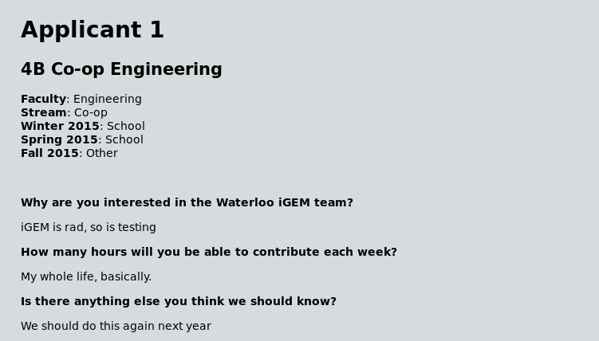

A script written for the 2015 [Waterloo iGEM](http://igem.uwaterloo.ca) team when going through new applicants. The script accepts applications in CSV format, with each row corresponding to one applicant. Details on input arguments provided in the script header.

[Various][1] [studies][2] [of job applications][3] have shown that obscuring applicant names increases the gender and racial diversity of the applicants accepted for interviews. This alone is a strong argument for anonymization, but it was also helpful for our team because it removed conflicts of interest caused by knowing some of the applicants personally. 

I hope this (very hacky) script is useful either to future iGEM teams or to others looking to anonymize job applications.

### Usage

Accepts CSV input and formats each row as an HTML document. Originally written for anonymizing applications for the Waterloo iGEM Team that were received the spreadsheet output of a Google Form.

#### Inputs

* **applications_csv**: CSV file containing rows to be converted into HTML docs
* **name_cols**: Entries in these column #s will be matched with row #s & output to a doc called `names_key.csv` with the row #s. You  may need to remove multiple columns for anonymization, e.g. e-mail addresses as well as names
* **grouping_cols**: Columns that should be used to identify the applicant by being added to the title. This script has a specific logic related to the Waterloo iGEM Subteams
* **info_cols**: Not question-and-answer, should be put in rows beneath the applicant info and subheading
* **subheading_cols**:  Pasted as a subheading below each applicant number in their HTML doc
* **question_cols**: The column title is assumed to be a question, which will be bolded and followed by the row's value for the column.

Default input values should produce decent results with the sample file `anonymizeApplications.testData.csv`.

#### Outputs

One HTML document per (non-header) row of applications_csv named `Appicant_<Row#>_<GroupingColsInfo>.html`

### Example

Open an R prompt (e.g. by typing `R` in your terminal) then, with the base directory of this repository as your working directory, enter:

```
source("anonymizeApplications.R")
anonymizeApplications()
```

This will use the data in `anonymuzeApplications.testData.csv` to produce four files: _Applicant_1_MAT_LAB.html_, _Applicant_2_MAT.html_, _Applicant_3_MAT_LAB.html_, and _names_key.csv_.

The HTML files will look something like this (which shows the formatting of the subheading and information columns):



[1]: http://mbc.metropolis.net/assets/uploads/files/wp/2011/WP11-13.html
[2]: http://blogs.nature.com/peer-to-peer/2008/01/doubleblind_peer_review_reveal.html
[3]: http://www.nber.org/papers/w5903.pdf?new_window=1
